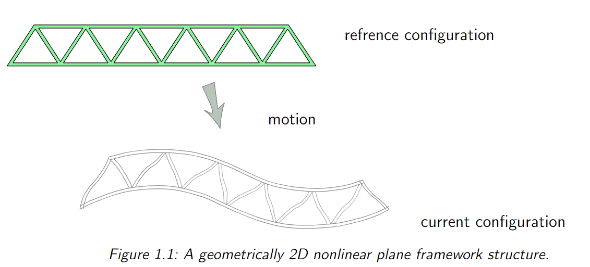

#  Geometrically Exact 2D Beam Theories: Finite Element Formulations and Comparative Analysis
## 1. Introduction
Nonlinear theories for beams have been developed over the past three decades. All of them apply to finite element discretization. Generally, three distinct approaches must be identified.

1. The first approach is based on the assumption of small strains. It involves a frame undergoing finite rigid rotations and formulates strains and stresses relative to its rotations, known as the co-rotational formulation. This approach requires the strains to be small but allows for investigating large deflections and rotations. Finite element schemes based on such formulations can be found in works such as Oran and Kassimali (1976), Wempner (1969), Rankin and Brogan (1984), Lumpe (1982), Crisfield (1991), and Crisfield (1997).
 2. The second approach utilizes continuum equations and incorporates beam kinematics through specific isoparametric finite element interpolations. Known as the degenerated continuum approach, examples of this method can be found in Bathe and Bolourchi (1979), Dvorkin et al. (1988), and the textbooks by Bathe (1996) and Crisfield (1997).
 3.  The third approach is grounded in the formulation of nonlinear rod and beam theories, which adhere solely to the classical assumption that "plane cross sections remain plane." This approach makes no further approximations; thus, strains, deflections, and rotations can be finite. These theories are referred to as \textbf{geometrically exact}. The development of these beam theories dates back to the work of Reissner (1972). A generalization for the three-dimensional case is presented in Simo (1985). Building on this theoretical foundation, several authors have developed associated finite element formulations, as seen in Simo and Vu-Quoc (1986), Pimenta and Yojo (1993), Jelenic and Saje (1995), Gruttmann et al. (1998), and Mäkinen (2007). For a nonlinear formulation of curved beam elements, refer to Ibrahimbegovic (1995). Gruttmann et al. (2000) considered elasto-plastic material, and Romero and Armero (2002) incorporated dynamics within the geometrically exact framework.

The latter beam theories also encompass the arbitrary loading of truss and cable structures, thus allowing for general application to one-dimensional construction elements. However, apart from very limited and simplified examples, these nonlinear beam theories cannot be solved analytically. Applying nonlinear beam formulations in the \textit{finite element methods} (FEM) framework poses no difficulty. Consequently, many complex engineering problems can be resolved, such as a rotor blade or deploying an antenna structure in space.

However, even now, many software tools for civil engineering still use the so-called second-order theories as the basis for finite element implementation. These theories include nonlinear effects but are restricted to small rotations. They can be applied for limit load computations and stability investigations. These theories stem from the times when analytic solutions were needed to solve such problems; however, when using modern computers, the geometrically exact theories can be applied instead.

In this contribution, different beam theories are considered for the two-dimensional case. Additionally, associated numerical formulations are derived for finite element implementations. The theories are compared using examples that depict the limits of applying different approaches.

### 1.1 Beam Model
#### 1.1.1 Basic Concepts and Terminology
Beams represent the most common structural component found in civil and mechanical structures. Because of their ubiquity, they are extensively studied analytically in Mechanics
of Materials courses. Such a piece of basic knowledge is assumed here. The following material recapitulates the definitions and concepts needed in the finite element formulation.

A beam is a rod-like structural member that can resist transverse loading applied between its supports. By “rod-like,” it means that one of the dimensions is considerably larger than the other two. This is called the longitudinal dimension and defines the longitudinal or axial direction. Directions normal to the longitudinal direction are called transverse. The intersection of planes normal to the longitudinal direction with the beam are called cross sections, just as for bar elements. The beam's longitudinal axis is directed along the longitudinal direction and passes through the centroid of the cross sections.

Beams can function as standalone structures or be combined to create framework structures, the latter being the most prevalent in high-rise building construction. Individual beam components within a framework are called members and are connected at joints. Frameworks differ from trusses because their joints are rigid enough to transmit bending moments between members.

In practical structures, beam members can take up various loads, including bi-axial bending, bidirectional shears, axial forces, and torsion. Such complicated actions are typical of spatial beams, used in three-dimensional frameworks and subject to forces applied along arbitrary directions. A plane beam resists primarily loading applied in one plane and has a cross-section with respect to that plane. Plane frameworks, such as the one illustrated in [Fig1](#Fig1), are symmetric assemblies of plane beams that share that symmetry. Those structures can be analyzed with two-dimensional idealizations. A beam is straight if the longitudinal direction is a straight line. A beam is prismatic if its cross-section is uniform. Only straight, prismatic, plane beams will be considered in this paper.

