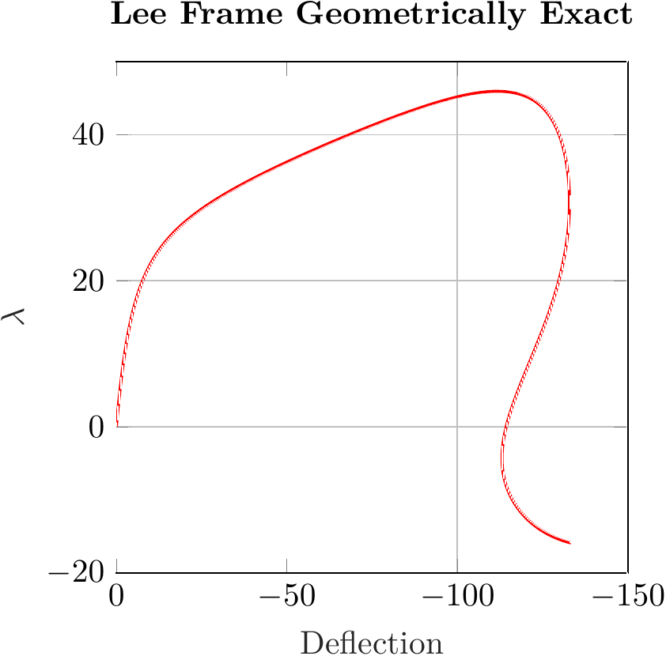

#  Geometrically Exact 2D Beam Theories: Finite Element Formulations and Comparative Analysis
This repository contains the results of my master's project, completed at Kassel University in 2017. My supervisors were Prof. Kuhl and Dr. Tobias Gleim. Recently, I have revised the code for clarity and added comments, and I believe it is now worthy of publication. The code is written in an object-oriented style using Matlab, with the main class being twoD_Beam.

Over the past three decades, nonlinear theories for beams have been developed, all of which are applicable to finite element discretization. Three distinct approaches are identifiable:

1. The first approach, predicated on the assumption of small strains, concerns a frame undergoing finite rigid rotations. It formulates strains and stresses relative to these rotations, known as the co-rotational formulation. This approach, allowing for large deflections and rotations, mandates that strains remain small. Finite element schemes based on this formulation are evident in works by Oran and Kassimali (1976), Wempner (1969), Rankin and Brogan (1984), Lumpe (1982), and Crisfield (1991, 1997).

2. The second approach involves continuum equations, integrating beam kinematics through specific isoparametric finite element interpolations, termed the degenerated continuum approach. Instances of this method are found in Bathe and Bolourchi (1979), Dvorkin et al. (1988), and textbooks by Bathe (1996) and Crisfield (1997).

3. The third approach bases itself on nonlinear rod and beam theories, strictly adhering to the classical assumption that "plane cross sections remain plane." It abstains from further approximations, allowing strains, deflections, and rotations to be finite. Termed geometrically exact, these theories trace back to Reissner (1972), with a three-dimensional generalization by Simo (1985). Subsequent finite element formulations were developed by Simo and Vu-Quoc (1986), Pimenta and Yojo (1993), Jelenic and Saje (1995), Gruttmann et al. (1998, 2000), Mäkinen (2007), Ibrahimbegovic (1995), and Romero and Armero (2002).

These latter theories also address the arbitrary loading of truss and cable structures, enabling broad application to one-dimensional construction elements. However, these nonlinear beam theories are generally unsolvable analytically, barring simplistic examples. In the finite element methods (FEM) framework, applying nonlinear beam formulations is straightforward, facilitating the resolution of complex engineering challenges like rotor blades or deploying antenna structures in space.

Currently, many civil engineering software tools still rely on second-order theories for finite element implementation. These incorporate nonlinear effects but are limited to small rotations, suitable for limit load calculations and stability analyses. Originating from an era necessitating analytic solutions, these theories are now superseded by geometrically exact theories with modern computing.

This contribution examines different beam theories for the two-dimensional case, deriving associated numerical formulations for finite element implementations. The theories are evaluated through examples, illustrating the limitations of various approaches.

Three numerical examples are investigated: the Lee frame, Williams' toggle beam, and the cantilever beam. Each is calculated using four different theories: geometrically exact beam theory, geometrically moderate beam rotation theory, Bernoulli beam theory, and second-order theory. For all theories except the second-order theory, the arc length method is employed to solve the nonlinear equations. However, for the second-order beam theory, the Newton-Raphson method appears to be more effective in addressing the nonlinearity. Some results of the Lee frame, displayed below, demonstrate the post-buckling behavior of the frame under extreme deflection. 

  
  

